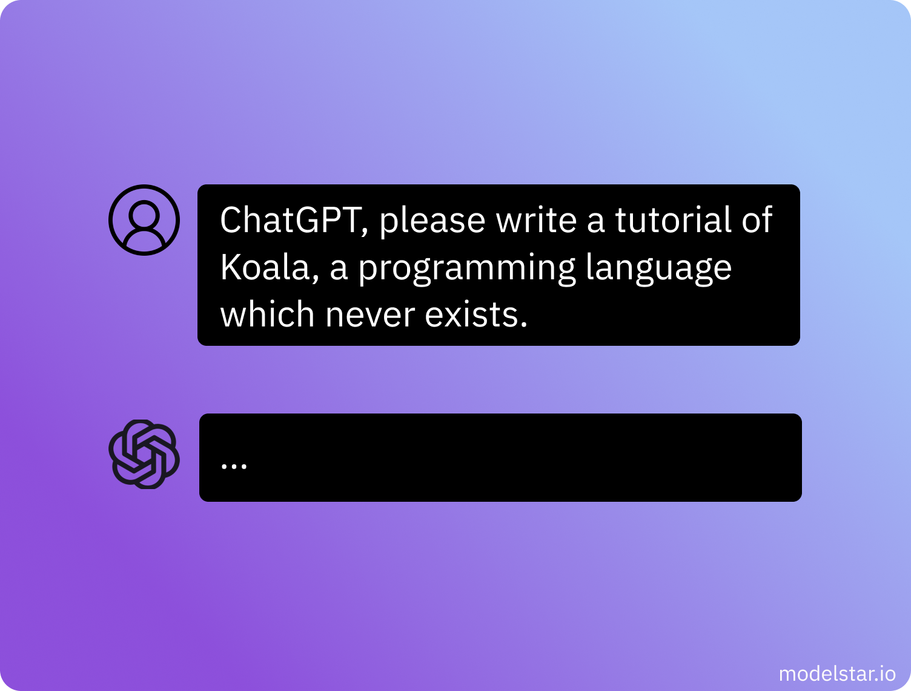
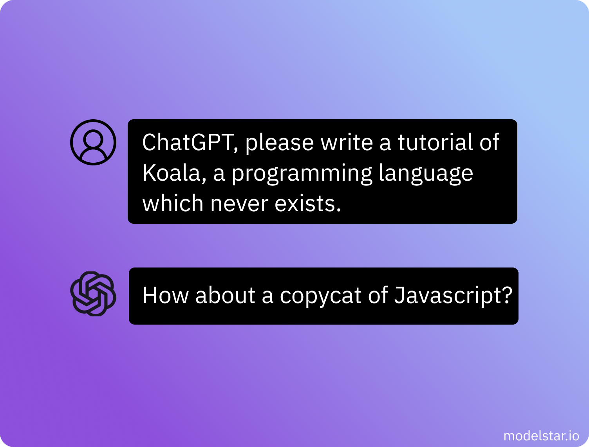

With the help of ChatGPT, I spent 1 hour to "write" a 65-page coding tutorial for beginners ([PDF](https://github.com/helincao/programming-tutorial-by-chatgpt/raw/main/koala-tutorial-by-chatgpt-helin.pdf); [Markdown](https://github.com/helincao/programming-tutorial-by-chatgpt/blob/main/full-text.md)). The AI also made up a programming language, called `Koala`, which never exists. Here is what I've learnt. 

<!--truncate-->

## Why I did it

- **[ChatGPT](https://chat.openai.com/chat) is this holiday season's shinny new toy for tech people.**
 I was excited to try it out, especially for [its improvement on long form conversation and detailed responses](https://openai.com/blog/chatgpt/). Inspired by [many interesting use cases](https://github.com/f/awesome-chatgpt-prompts) from the community, I decided to use its help to write a tutorial on a topic I would never do myself.

- **It's a technology that can potentially change how I work.**
 As a dev tool developer, I've written many tutorials before, and hope to learn if ChatGPT can be useful in this space.

## How did it go
:::tip
Except for aforementioned tutorial, everything else on this website was typed by humans one key stroke at a time. So I ended up spending more time on this blog post than on the 65-pager.
:::

### What's impressive

**ChatGPT generated almost everything: from introduction, sample code, to the well-structured full table of content**

The tutorial started with an introduction.

Then I asked ChatGPT to design its own table of content. The prompt is really simple. But, to further abuse the system, I asked for the content to be a markdown string. So, I could just copy-paste it as is to my markdown file, and spend zero energy on manual editing. It's actually not that hard to convince AI to embrace my laziness on steroids. This is what I got.

As a result, ChatGPT outlined 6 chapters, and they all seem very reasonable to me. Then I started generating sections one by one. Most of the time, my prompts were like: 
> write section: <section name (copied from the table)\>

After 3 prompts, Chapter #1 is done. That's very nice. 

### Not so impressive

- **ChatGPT-generated fake programming language is merely a copycat of Javascript**

  

  When working on the 2nd chapter, ChatGPT would have to choose a programming language to continue. I wanted to add more fun, so asked the AI to write about "Koala", a programming language that never exists. ChatGPT seemed to understand what I wanted, but decided to create something very similar to Javascript. 

  From the code sample, what I can tell is: one or two of Koala's syntax might be slightly different, such as `func` (Koala) vs `function` (Javascript). 

  

- **Overused "overall"**

  I noticed most section's last paragraph start with "overall". ChatGPT definitely "learned" this from training materials. I suspect that some particular patterns could also be reinforced during a conversation, which leads to so many "overall"s in our tutorial. I have not found a good way to change that other than adding "do not use 'overall' in this section" to a prompt.

## Alright, overall
- I never spent more than 3 mins on any AI bot before. ChatGPT easily extended this metrics by a order of magnitude. It's super fun. 

- An end-to-end tutorial AI writer can be easily built once OpenAI launches official ChatGPT API service. As I spent most time on copy-pasting between the prompt and file editor, an end-to-end writer can probably create one under 5 mins.

