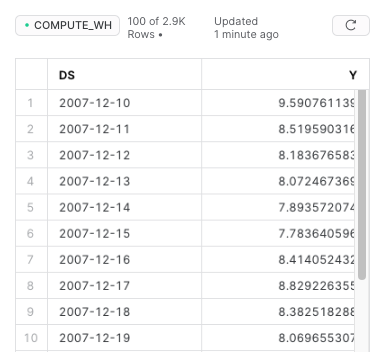

# univariant_time_series_forecast

## Use case and tutorial
- [Sales Forecasting with 1 Line of SQL](../../tutorials/sales-forecasting-inside-snowflake.md)

---

## Input data prerequisite
Input data is a univariant time series data: a sequence of integer or float data points indexed in timestamp. The table to be used should include in the following two columns: 
- A Time stamp column. Data type: `Date & Time Data Types`. 
- A value column. Data type: `Fixed-point Number` or `Floating-point Number`. 

:::note
Extended reading. Snowflake docs about:
[Date & Time data types](https://docs.snowflake.com/en/sql-reference/data-types-numeric.html); 
[Numeric data types](https://docs.snowflake.com/en/sql-reference/data-types-numeric.html).
:::

Sample dataset:




---
## Syntax
```javascript
univariant_time_series_forecast(<table_name>, 
                                <time_column_name>, 
                                <value_column_name>, 
                                <forecast_period>,
                                <period_unit>)
```

### Arguments

`<table_name>` (string) - the datatable's name.

`<time_column_name>` (string) - the name of a timestamp column in the datatable.

`<value_column_name>` (string) - the name of a value column to be forecasted.

`<forecast_period>` (integer) - forecast period.

`<period_unit>` (string) - unit alias of the period. 

**Available unit aliases and descriptions:**

| Alias string  | Description       |
| ------------- | ------------- |
| 'B'  | business day |
| 'D'  | calendar day |
| 'W'  | week |
| 'M'  | month |
| 'Q'  | quarter |
| 'Y'  | year |


### Example

```sql
CALL univariant_time_series_forecast('sales_table', 'sales_date', 'total_sales', 24, 'M');
```
