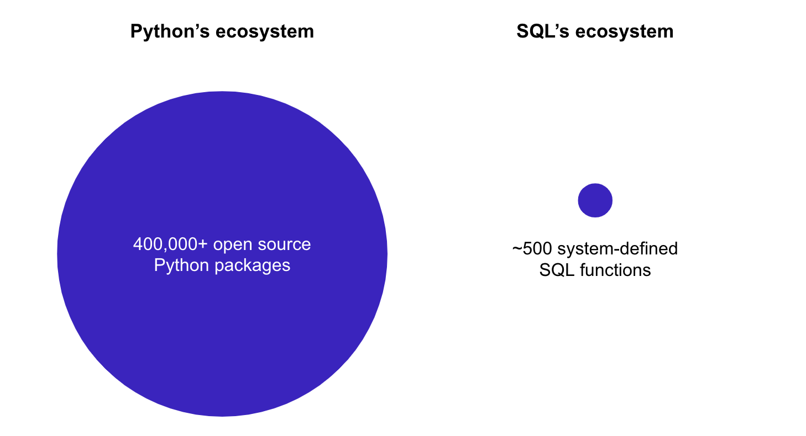

# What are Python UDFs and Stored Procedures

UDFs and Stored Procedures are used to modularize SQL statement.

## What are UDFs?

In data platforms (warehouse, lakehouse), a UDF (user-defined function) lets you extend the data transformations/operations that are not available through built-in system-deifned functions. These are stored as database objects that can be evaluated in standard query language (usually SQL) statements.

UDFs are typically evaluated row wise, but they can also be extended to evaluate on a table through vectorization of the function or as [Store Procedures](#what-are-stored-procedures).

:::tip
Modelstar let's you define and run Python based UDFs, thereby extending SQL to the [powers of Python](#pythons-super-powers).
:::

<!-- TODO: Add an example code here to show how a UDF in python is defined and how it is called in SQL. -->

## What are Stored Procedures?

A SProc (stored procedure) is a prepared SQL code that you can save, and reuse it. In general it consists of a bunch of SQL statements, that can include transformations and creation/deletion of tables. To execute a stored procedure you `CALL` it.

Parameters can also be passed to a SProc, so that the SProc can act based on the parameter value(s) passed.

:::tip
Modelstar lets you define SProc as a Python function. This function can take in parameters, which also include table names that are made available inside your function as a dataframe.
:::

<!-- TODO: More on SProcs can be found here, which includes information about limitations, best practice, when to use one and examples. -->

## UDFs and SProcs bring Python's superpower to SQL

### What problems Python UDFs and SProc solve:
-   **Hard-to-read SQL statements**
    No one likes lengthy SQL statements. It’s hard to read, modify and reuse, causing technical debts.
-   **Limited SQL capability**
    SQL is good at aggregation and filter based data manipulation, but has limited usages in something a bit more complex, such as predictive analytics, machine learning, etc..

### Python's strong ecosystem
Python's ecosystem can complement SQL in the following ways:

-   **Matured development tool chains** Python is used for both scripting and serious software projects. Its tool chains (development, testing, logging, CI/CD, etc.) have evolved to support web-scale applications, so teams can collaborate well to build complex systems.
-   **Data related packages** SQL and Python are the top 2 languages used for data transformation. Data practitioners who leverage both languages can easily build elegant solutions.

## Some issues that could happen during Python UDF deployment

#### Test coverage issue
Sometimes a function works perfectly in local dev environment, but breaks in warehouses.

#### Deployment issue
Snowpark's `Session.udf.register()` relies on manual efforts to map out dependencies and handle files. Once projects become complicated, such manual efforts should be replaced by modern CI/CD pipelines.

#### Observability issue
There're no observability on how well our UDFs run in a warehouse. In production, developers want to know telemetry, availability, logs, errors, status, and usage.

:::tip
Modelstar is developed to solve the above issues.
:::