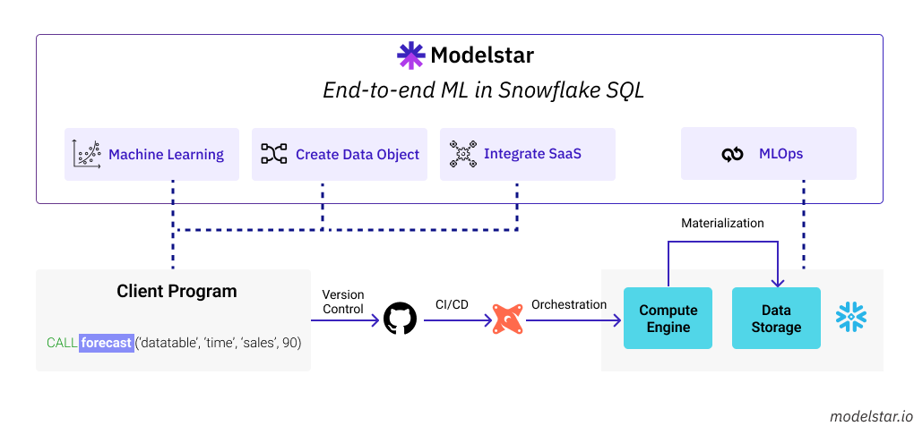

# Introduction

ModelStar provides easy-to-use tools to deploy Python data transformation code as UDFs (User Defined Functions) and Stored Procedures inside Snowflake.

:::info

We will add support to other data platforms such as Databricks and BigQuery after v0.5.

:::

## How does Modelstar work?

<h3>Life cycle management of Snowflake Python UDFs/Stored-Procedures </h3>

Modelstar streamlines Snowflake UDFs and Store Procedures deployment with:

-   Automagically dependency mapping
    -   libraries
    -   local packages
    -   local files
-   Support of most Python testing frameworks
-   Integration with Git for version control

:::info

Modelstar is currently in the pre-release phase. We're working with design partners to polish and prioritize features. Interested in becoming a design partners, drop us a line: dev@modelstar.io

:::

<!-- TODO: Roadmap -->
