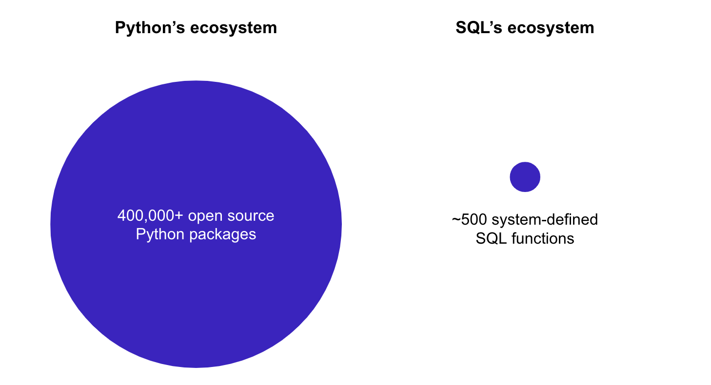

# What is Modelstar?

ModelStar provides easy-to-use tools to develop and run Python data transformation code as UDFs (User Defined Functions) and Stored Procedures inside data warehouses.

:::info

We’re currently in our pre-release phase, working with design partners to polish features. To try it out, contact us: dev@modelstar.io

:::

## What are UDFs?

In data platforms (warehouse, lakehouse), a user-defined function lets you extend the data transformations/operations that are not available through built-in system-deifned functions. These are stored as database objects that can be evaluated in standard query language (usually SQL) statements.

UDFs are typically evaluated row wise, but they can also be extended to evaluate on a table through vectorization of the function or as [Store Procedures](#what-are-stored-procedures).

Modelstar let's you define and run Python based UDFs, thereby extending SQL to the [powers of Python](#pythons-super-powers).

<!-- TODO: Add an example code here to show how a UDF in python is defined and how it is called in SQL. -->

## What are Stored Procedures?

A stored procedure is a prepared SQL code that you can save, and reuse it. In general it consists of a bunch of SQL statements, that can include transformations and creation/deletion of tables. To execute a stored procedure you `CALL` it.

Parameters can also be passed to a stored procedure, so that the stored procedure can act based on the parameter value(s) passed.

Modelstar lets you define stored procedure as a Python function. This function can take in parameters, which also include table names which are made available inside your function as a dataframe.

<!-- TODO: More on SProcs can be found here, which includes information about limitations, best practice, when to use one and examples. -->

# Why use Modelstar?

**Python UDFs can be very helpful for data analysts and engineers.**

What problems UDFs solve:

-   **Hard-to-read SQL statements**
    No one likes lengthy SQL statements. It’s hard to read, modify and reuse, causing technical debts.
-   **Limited SQL capability**
    SQL is good at aggregation and filter based data manipulation, but has limited usages in something a bit more complex, such as predictive analytics, machine learning, etc..

## Python's super powers

### What superpowers that Python has to complement SQL:

-   **Matured development tool chains** Python is used for both scripting and serious software projects. Its tool chains (development, testing, logging, CI/CD, etc.) have evolved to support web-scale applications, so teams can collaborate well to build complex systems.
-   **A strong ecosystem** SQL and Python are the top 2 languages used for data transformation. Data practitioners who leverage both languages can easily build elegant solutions.

## _But!_ Deploying and managing UDFs is frustrating.

#### Testing issue

We often find a function works perfectly in local dev environment, but breaks in warehouses.

#### Deployment issue

Snowpark provides Session.udf.register() to deploy custom Python functions to UDFs. However, it relies on manual effort to map out dependencies and handle files. Furthermore, it does not fit in modern CI/CD pipelines.

#### Observability issue

Users have no observability on how well their own UDFs perform: telemetry, availability, logs, errors, status, and usage.

## Supported Data Platforms

At the moment we support Snowflake and are working on other warehouses and lakehouses.

<!-- TODO: Roadmap -->
