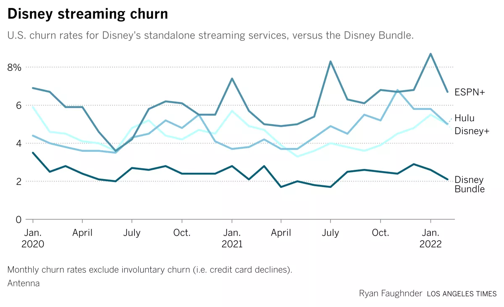

# Churn prediction inside Snowflake with 1 Line of SQL

This tutorial provides the steps to build a churn prediction model and a report. It covers:

-   **Basic concept**: about churn prediction and related machine learning technology.
-   **`train_binary_classifier` and `predict_binary_classifier` SQL syntax**: to obtain a binary classifier and use it for inference
-   **Model quality report**: a dashboard that shows 12 models training on the data set and important metrics of the selected model. 

# How a churn prediction model can help business growth

### What's churn and why it's important
Customer churn is one of the most important metrics for subscription-based business. It directly measures how many customers stop paying for a product or service, which indirectly tells how much customers value your product.

For example, this graph is churn rates of Disney streaming products in the past 2 years. It shows the bundle product has the lowest churn rate, and the rate is quite stable over the 2-year's period.

A growing business need to keep acquiring new customers, and maintain prevent exiting ones from churning as well. It's more cost efficient if a company's business team can identify customers who are about to churn, and take actions to delight them before they decide to leave.

### A common process to run churn analysis

The first challenge is to gather enough data of user profile and behavior. Profile data can be useful to identify user segment. Behavior data tells  how a specific user interacts with a product. Can they get things done as the product promised, or easily get frustrated due to product defects?

Data is never enough, so it's always a good idea to start small. Based on some preliminary results, business, data, and engineering teams can collaboratively design new metrics and add them based on priorities. 

The next step is to choose analysis method. In this tutorial, we treat churn analysis as a prediction problem. A classifier model is to be trained to predict if a customer will or will not churn based on previous data.

Business value will not be realized until the analyst team figures out how to prevent customers from leaving and provides actionable items, such as a new pricing model or post-sale support term. In this tutorial, we show a classifier model can also rank feature importance, which can be used as a good starting point to drill down what really matters to churn.

### The 2 AutoML SQL commands to train and deploy a churn classification model

Modelstar provides an AutoML solution to enable SQL users to automatically obtain the best model trained from 12 ML algorithms. The 2 SQL commands `train_binary_classifier` (for model training) and `predict_binary_classifier` (for inference) automate the churn analysis process. They're developed based on our favorite open source Python AutoML library: `PyCaret`. It supports a large data scientist community (~7K GitHub Stars), and is widely used in industry (~1M downloads /month).

# Pre-requirements

### 1) Install Modelstar CML tool

<!-- To do: give some links to other articles -->

### 2) Register the classifier AutoML algorithms to Snowflake

<!-- To do: give the `modelstar register` command -->

### 3) Sample data

<!-- To do: show how the data looks like, and how to upload it to Snowflake -->

# Train the churn prediction model

### Train the model

### Read the model performance report

# Predict churn

### Run inference function

:::tip
Modelstar also supports scheduling the inference through DBT. This feature is currently in development.
:::