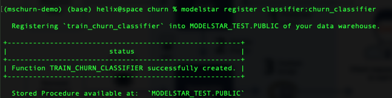
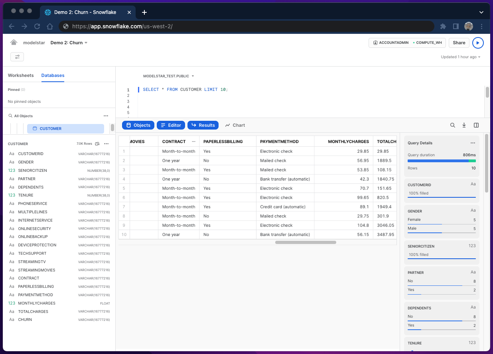
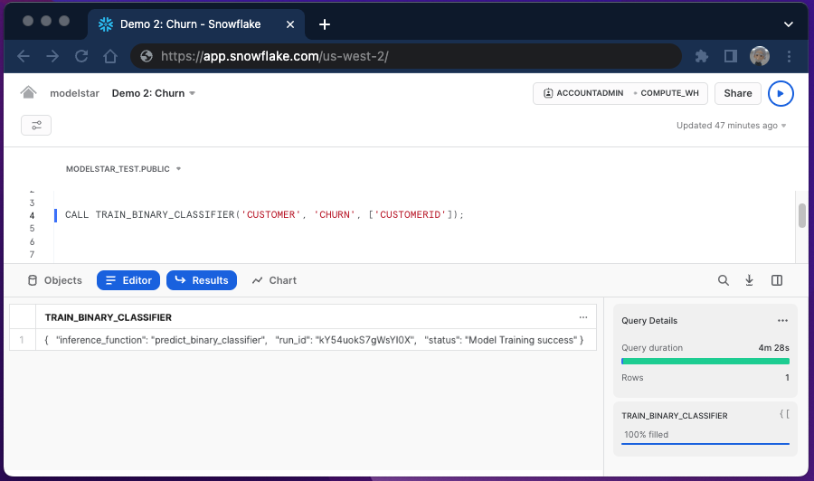
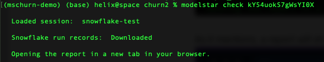
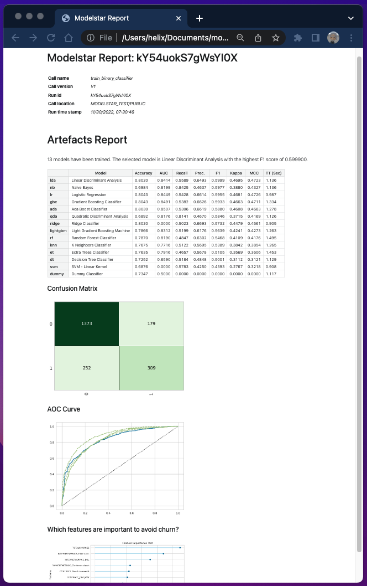
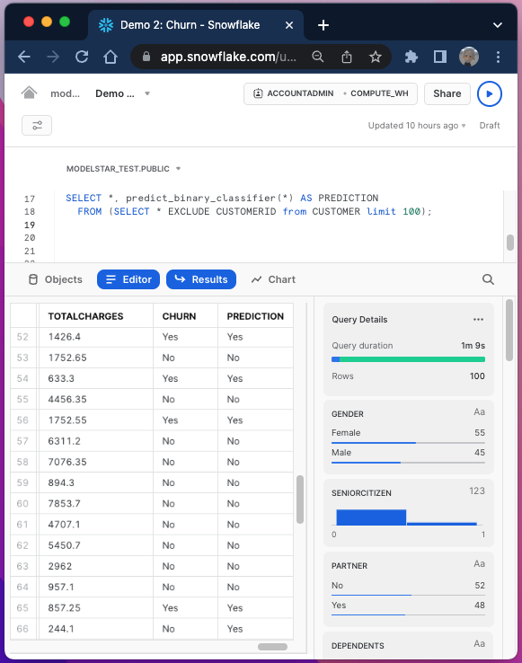

import TitleImage from './title-image.png';
import DbtLogo from './dbt.png';
import DisneyData from './disney-data.webp';
import ConfusionMatrix from './cm.webp';

# Churn prediction inside Snowflake with 1 Line of SQL


This tutorial provides the steps to ship a churn prediction model and a model performance report. It covers:

-   **Basic concept**: about churn prediction and related machine learning technology.
-   **`train_binary_classifier` and `predict_binary_classifier` SQL syntax**: to obtain a binary classifier and use it for inference
-   **Model performance report**: a dashboard that shows 12 models training on the data set and important metrics of the selected model. 


## Churn prediction boosts business growth

### What's churn and why business teams track it
Customer churn is one of the most important metrics for subscription-based business. It directly measures how many customers stop paying for a product or service, which tells how much customers value your product.

For example, this graph shows churn rates of Disney streaming products in the past 2 years. It shows the bundle product has the lowest churn rate, and the rate is quite stable over the 2-year's period.


A growing business needs to keep acquiring new customers, while prevent exiting ones from churning as well. It's more cost efficient if a company's business team can identify customers who are about to churn, and take actions to delight them before they leave.


### A common process to run churn analysis

The first challenge is to gather enough data of user profile and behavior. Profile data can be useful to identify user segment. Behavior data tells  how a specific user interacts with a product. Can they get things done as the product promised, or easily get frustrated due to product defects?

Data is never enough, so it's always a good idea to start small. Based on some preliminary results, business, data, and engineering teams can collaboratively design new metrics and add them based on priorities. 

The next step is to choose analysis method. In this tutorial, we treat churn analysis as a prediction problem. A classifier model is to be trained to predict if a customer will or will not churn based on previous data.

Business value will not be realized until the analyst team figures out how to prevent customers from leaving and provide actionable items, such as a new pricing model or post-sale support term. In this tutorial, we show a classifier model that can rank feature importance, which can be used as a good starting point to drill down what really matters to churn.

### Modelstar AutoML streamlines churn predction modeling

Modelstar provides an AutoML solution to enable SQL users to automatically obtain the best model trained from 12 ML algorithms. The 2 SQL commands `train_binary_classifier` (for model training) and `predict_binary_classifier` (for inference) automate the churn analysis process. They're developed based on our favorite open source Python AutoML library: `PyCaret`. It supports a large data scientist community (~7K GitHub Stars), and is widely used in industry (~1M downloads /month). 

Let's get started.

## Pre-requirements

### Install Modelstar

Modelstar is an open source command line tool. Follow [Step #1-3 in Quickstart page](https://modelstar.io/docs/quickstart/) to install it and initialize your session. 


### Register the AutoML binary classification algorithm

Run this command:

```shell
$ modelstar register classifier:binary_classifier
```

A success message is like:


### Sample data (optional)

If you want to try our sample data, just run the following command in your Modelstar project directory.

```shell
$ # change to Modelstar project directory
$ cd ./churn_project
$ # upload the sample data and create a table in snowflake
$ modelstar create table sample_data/customer_data.csv:CUSTOMER
```
Here is a snapshot of the data table. 



It has 7k rows and 21 columns. Some columns denote user profile, such as "GENDER". Some (e.g. "CONTRACT") contain user behavior data. We will use both user profile and behavior data as `feature`s to build the ML model. Among all, "CHURN" is a special column which labels whether a customer has churned. Note that "CHURN" is `binary`: either "Yes" or "No". This is the `target` column for modeling. The goal is to let the model predict `target` value based on given `feature`s.

:::tip
The same dataset has also been used in [a PyCaret's tutorial written by its creator Moez Ali](https://towardsdatascience.com/predict-customer-churn-the-right-way-using-pycaret-8ba6541608ac). It's recommended for those who're interested in how to train, select and fine-tune a model using PyCaret. Modelstar streamlines all the necessary steps to implement this in Snowflake and provides an abstract SQL interface, as shown in the next section.
:::

## Ship a churn prediction model in 3 simple steps

### Step 1: Model training in Snowflake Worksheet

Run the following SQL statement in Snowflake Worksheet if you use the sample data provided by Modelstar.

```sql
CALL TRAIN_BINARY_CLASSIFIER('CUSTOMER', 'CHURN', ['CUSTOMERID']);
```

**Semantic meaning of this statement:** to train a binary classifier using data in "CUSTOMER" table, where column "CHURN" is the `target`, and "CUSTOMERID" column should be ignored as it's not a good feature. See its [API doc](../../api/ml-sql-functions/train-binary-classifier/) to learn more about the parameters.

**Under the hood:** 12 models (see the [full list of classification algorithms](../../api/ml-sql-functions/train-binary-classifier/#algorithm-details)) are automatically trained and ranked, then the best model is selected and fine-tuned. 

The training time varies depending on the size of your WH engine. We use an x-small WH, and it takes 4.5 mins to finish. After the training is done, it returns a success message, including a `inference_function` (to be [discussed later](#run-inference-function)) and a `run_id` (to fetch the [model performance report](#model-performance-report)).




### Step 2: Model performance report
To fetch the report, simply run the following command in your terminal:

```shell
$ modelstar check <run_id>
```

A successful run looks like this:



The report is auto-generated. The table shows performance metrics of each model (including a dummy model) we just trained inside Snowflake, and the results are sorted based on `F1` score. 

`Confusion matrix` and `AOC curve` of selected model (Linear Discriminant Analysis in our example) show more details about how well the model can predict positive and negative cases. Check "Glossary" at the end of this page for their meanings.

Last but not least, our model also automatically ranks features based on their importance. This plot can provide critical insights for analysts on how to optimize user experience to improve churn. Note that, the feature importance plot may not show up every time as some algorithms (e.g., Naive Bayes) do not support feature ranking.




### Step 3: Model inference
If you're happy with what you see in the performance report, you can use the model to make predictions on new data. 

New data table should have the same feature columns as your training data. The order of columns in both training and inference data should also be identical. For simplicity of this tutorial, let's do inference on the same training table. 

Run the following SQL script in Snowflake Worksheet: 

```sql
SELECT *, predict_binary_classifier(*) AS PREDICTION 
  FROM (SELECT * EXCLUDE CUSTOMERID from CUSTOMER limit 100);
```

The query constructed based on `predict_binary_classifier`, a Snowflake UDF automatically generated based on the trained model. We simply pass the feature column names. Note that we must exclude "CUSTOMERID" here, to match the parameters passed to the training function.



This query generates a new column "PREDICTION" to contain the prediction results. Simply comparing it with the factual column "CHURN", we can see some accurate predictions as well as some false positive cases (e.g. row 66). 

Execution of inference can be 3-4X faster than training, which is quite common. In general, for such use case, training can be scheduled every other weeks, and inference can run more often (e.g. daily).

:::tip


We're working on new features that allow training and inference to be scheduled and materialized through [DBT](https://www.getdbt.com/). Stay tuned.
:::

:::note
**GLOSSARY:**

**F1 score:** A commonly-used model performance measure of imbalanced training data. It's the harmonic mean of the precision and recall, thus its value falls between 0 and 1, with 1 being the best result. Modelstar can automatically detect data skew and choose appropriate metrics to rank models.

**ROC curve:** ROC curve stands for "Receiver Operating Characteristic curve". It's plotted as true positive (TP) rate vs. false positive (FP) rate. A ROC curve simply shows the correlation between TP and FP of a binary classification model. The ideal result is TP=1 and FP=0. However, an actual model performance is always tradeoff between the two metrics.

**Confusion matrix:** It's a table with predicted and actual values on both positive and negative cases as illustrated in this diagram (image credit: Joydwip Mohajoni). 

:::