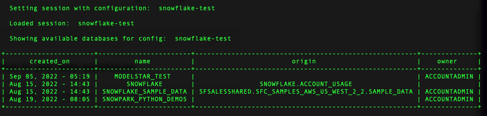
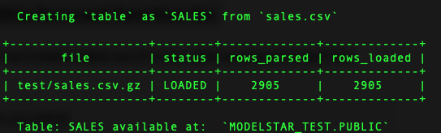
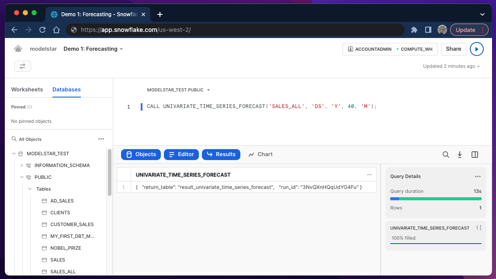

# Forecast Sales inside Snowflake with 1 Line of SQL

This tutorial provides the steps to build a sales forecasting model and a report. It covers:
- Basic ideas about sales forecasting use cases and technology
- Modelstar installation
- Modelstar `univariant_time_series_forecast` API
- Modelstar sample sales data
- Forecasting report

The hands-on procedure takes about 15 minutes. By the end of this example, you will know how to train a forecast model inside Snowflake, and generate a report showing model performance like this:


## What is Forecasting and its use cases

### Sales forecasting is rudimentary for business management

Sales forecasting is to estimate the quantity of products or services that can be sold in the future over the forecast period. It can help companies make proper business decisions on supply chain management, financial planning, product roadmap, and hiring strategy, etc. With accurate and timely forecasting results, business management can have a better understanding of how to mitigate risks or take advantage of tailwinds.

### Technical challenges to predict future

Sales forecasting is an application of time series analysis. There're several components to consider:
- Seasonality: periodic changes over time. Example: Higher coffee consumption in mornings. 
- Trend: continuous non-periodic changes. Example: Company sales growth in the past 5 years.
- Disruptive events: sudden changes. It can be driven by both predictable factors, such as holidays or service maintenance, and unpredictable issues, such as random errors or bugs.

A good prediction algorithm should capture most of the components, and statistically predict future with a certain confidence level.

### SQL 1-liner for forecasting

Modelstar lets you ship and manage forecasting models and visualize modeling results with 1 line of SQL inside Snowflake. Under the hood, Modelstar provides pre-built forecast algorithms, and exposes them as SQL analytical APIs. In this example, we will be using `univariant_time_series_forecast` ([API doc](../api/ml-sql-functions/univariant-time-series-forecast)). This API is based on an open source library [Prophet](https://facebook.github.io/prophet/). It's one of the most widely used forecast algorithms in industry.

:::note
Modelstar is built on some new features recently launched by Snowflake and DBT, such as Snowpark and DBT Python Model. It automatically handles file I/O in Snowflake Stage and manage model artifacts.
:::


## Preparation for the SQL ML journey
This session is for first time Modelstar users. To set up Modelstar, let's there’re 3 commands to run on you computer:

### Install Modelstar
```shell
$ pip install modelstar
```

Verify the installation with a version check
```shell
$ modelstar --version
```

### Initialize a Modelstar project

```shell
$ modelstar init sales_forecast
```

:::tip
`modelstar init <project_name>` is the base command, where <project_name> can be replaced with the name of your choice.
:::

You will see `sales_forecast` folder created in your working directory.


### Config Snowflake session 

In `sales_forecast` folder, find file `modelstar.config.yaml` and open it with your favorite editor. Add account info and credential to it. Feel free to name the session with any name. In this example, we use `snowflake-test`.


### Ping Snowflake

We can now start a Modelstar session from your terminal. Run the following:

```shell
$ modelstar use snowflake-test
```
`modelstar use <session name>` is the command, if you gave another session name, use that to replace `<session name>`. A success ping should lead to something like:




### Register the forecast algorithm to Snowflake

Run this command:
```shell
$ modelstar register forecast:univariate_time_series_forecast
```

Success message is:


### Upload sample data to Snowflake
If you want to try the forecast algorithm on a sample sales dataset, run this command to create a data table in your data warehouse. You can skip this step if you want to try your own data.

```shell
$ modelstar create table sample_data/sales.csv:SALES
```



## Build a forecast model using a SQL 1-linear

If you use our sample data, run this SQL statement inside snowflake:

```sql
CALL UNIVARIATE_TIME_SERIES_FORECAST('SALES_ALL', 'DS', 'Y', 40, 'M');
```




