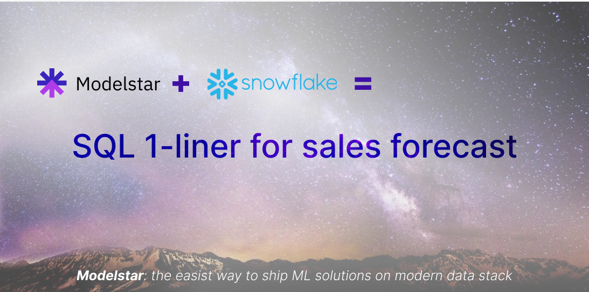
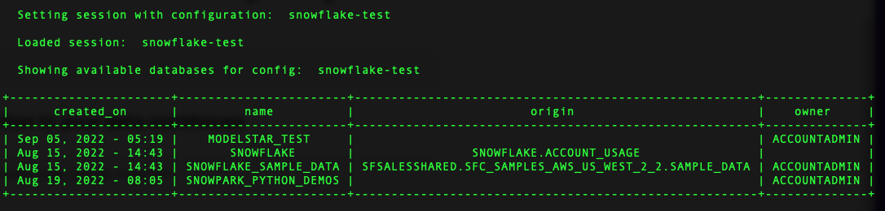
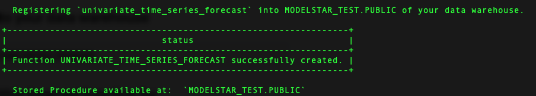
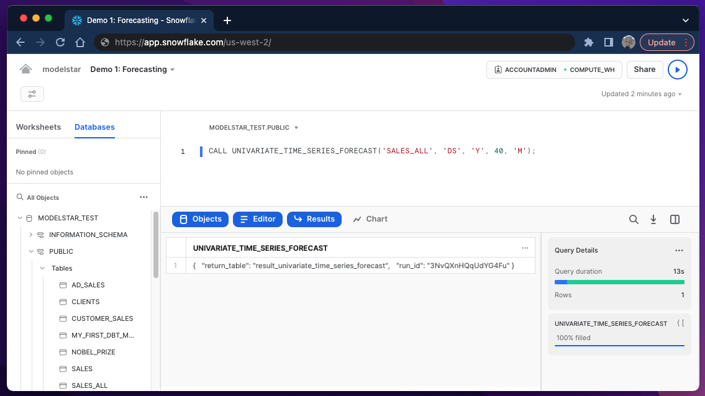
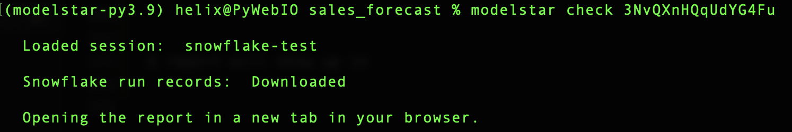
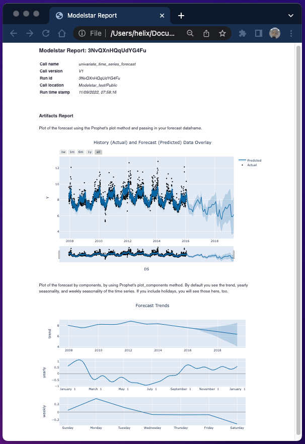
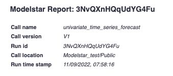
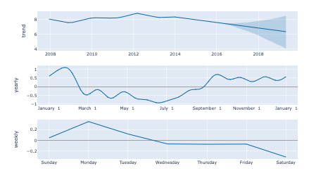

import ForecastChart from './sales-forecast-assets/forecast-chart.png';

# Forecast Sales inside Snowflake with 1 Line of SQL



This tutorial provides the steps to build a sales forecasting model and a report. It covers:
- **Basic concept**: about sales forecasting use cases and technology.
- **Modelstar CML tool**: Modelstar installation guide
- **`univariant_time_series_forecast` SQL syntax**: the SQL 1-liner to make forecast
- **Forecasting report**: forecast results ready to be consumed by business teams

By the end of this example, you will know how to train a forecast model inside Snowflake, and generate a report showing model performance like this:


## What is Forecasting and its use cases

### Sales forecasting is rudimentary for business management

Sales forecasting is to estimate the quantity of products or services that can be sold in the future over the forecast period. It can help companies make proper business decisions on supply chain management, financial planning, product roadmap, and hiring strategy, etc. With accurate and timely forecasting results, business management can have a better understanding of how to mitigate risks or take advantage of tailwinds.

### Technical challenges to predict future

Sales forecasting is an application of time series analysis. There're several components to consider:
- Seasonality: periodic changes over time. Example: Higher coffee consumption in mornings. 
- Trend: continuous non-periodic changes. Example: Company sales growth in the past 5 years.
- Disruptive events: sudden changes. It can be driven by both predictable factors, such as holidays or service maintenance, and unpredictable issues, such as random errors or bugs.

A good prediction algorithm should capture most of the components, and statistically predict future with a certain confidence level.

### The SQL 1-liner for forecasting

Modelstar lets you ship and manage forecasting models and visualize modeling results with 1 line of SQL inside Snowflake. Under the hood, Modelstar provides pre-built forecast algorithms, and exposes them as SQL analytical APIs. In this example, we will be using `univariant_time_series_forecast` ([API doc](../api/ml-sql-functions/univariant-time-series-forecast)). This API is based on an open source library [Prophet](https://facebook.github.io/prophet/), which is one of the most widely used forecast algorithms in industry.

:::note
Modelstar is built on some new features recently launched by Snowflake and DBT, such as Snowpark and DBT Python Model. It automatically handles file I/O in Snowflake Stage and manage model artifacts.
:::


## Preparation for the SQL ML journey
This session is for first time Modelstar users to set up Modelstar. 

### Step #1: Install Modelstar
```shell
$ pip install modelstar
```

Verify the installation with a version check
```shell
$ modelstar --version
```

### Step #2: Initialize a Modelstar project

```shell
$ modelstar init sales_forecast
```

:::tip
`modelstar init <project_name>` is the base command, where <project_name> can be replaced with the name of your choice.
:::

You will see `sales_forecast` folder created in your working directory.


### Step #3: Config Snowflake session 

In `sales_forecast` folder, find file `modelstar.config.yaml` and open it with your favorite editor. Add account info and credential to it. Feel free to name the session with any name. In this example, we use `snowflake-test`.


### Step #4: Ping Snowflake

We can now start a Modelstar session from your terminal. In the directory of the newly generated Modelstar project (in our example, it's `./sales_forecast/`), run this:

```shell
$ modelstar use snowflake-test
```
`modelstar use <session name>` is the command, if you gave another session name, use that to replace `<session name>`. A success ping should lead to something like:




### Step #5: Register the forecast algorithm to Snowflake

Run this command:
```shell
$ modelstar register forecast:univariate_time_series_forecast
```

Success message is:



### Step #6: Upload sample sales data to Snowflake
If you want to try the forecast algorithm on a sample sales dataset, run this command to create a data table in your data warehouse. You can skip this step if you want to try your own data.

```shell
$ modelstar create table sample_data/sales.csv:SALES_ALL
```

This command uploads sales.csv file to Snowflake and creates a table called 'SALES_ALL'.


## Build a forecast model using a SQL 1-linear

### Run this script in Snowflake Worksheet
If you use our sample data, run this script:

```sql
CALL UNIVARIATE_TIME_SERIES_FORECAST('SALES_ALL', 'DS', 'Y', 40, 'M');
```
It means: to predict the next `40` `M` (months) of `Y` value based on historical data in `SALES_ALL` table, where `DS` is the time column.




### To run the forecasting algorithm on your own data

Under the hood, the forecast algorithm runs inside Snowflake as a Stored Procedure. It takes the following parameters:

| Parameter  | Type  |  Description       | Example
| ------------- | ------------- | --------|-------|
| `<table_name>`  | string | Sales data table name | 'SALES_ALL'  |
| `<time_column_name>`  | string | Timestamp column name | 'DS' |
| `<value_column_name>`  | string | value of interests | 'Y' |
| `<forecast_period>`  | integer | forecast period | 40 |
| `<period_unit>`  | integer | unit alias of the given period | 'M' (month)|

To config your own forecast period, check [this API doc](../api/ml-sql-functions/univariant-time-series-forecast) for a full list of unit alias.

### Check the result
After the model training is finished, in the Snowflake Results window, a successful run should output a json string similar to this:

```json
{
  "return_table": "result_univariate_time_series_forecast",
  "run_id": "3NvQXnHQqUdYG4Fu"
}
```

It means a table named "result_univariate_time_series_forecast" has been created to materialize the prediction data, and the run id ("3NvQXnHQqUdYG4Fu") can help you pull a prediction report. Simply run this command in your local computer:

```shell
$ modelstar check <run_id>
```

The following message should be seen in your terminal:


As it mentions, a report will show up in your browser:



### What's in the report

The report includes 3 sections:

- **Meta information of this run**

    


- **Forecasting chart**: to check modeling quality and forecast results.

    

- **Component analysis**: to illustrate trend and seasonality your model has "learned", including an overall trend, and yearly and weekly seasonality (cyclical patterns over 1 year/week).

    

:::note
**GLOSSARY:**

**In-sample and out-of-sample forecast.**
From in-sample forecast, you can check how well the forecast model fits actual data. Out-of-sample forecast shows prediction of the future.


**Uncertainty Intervals: the band between the upper and lower bounds.**
It means there is a 80% probability that the true value falls within that interval. A higher requirement of certainty leads to wider band (see [Bartosz's article](https://www.mikulskibartosz.name/understanding-uncertainty-intervals-generated-by-prophet/)). Uncertainty also grows as we go farther into the future, leading to a widened band as a function of time.
:::